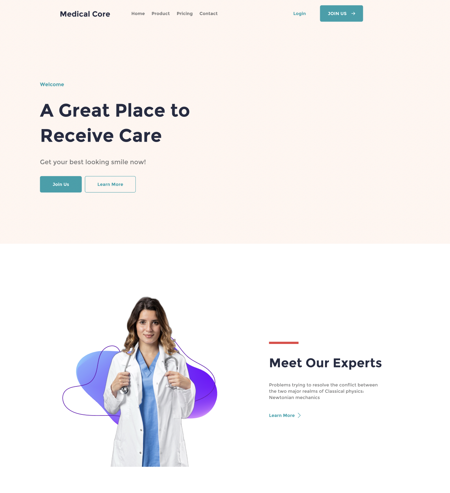

# medical-core-clone

    
    

A landing page of Medical Core built as part of an exercise from [The-Gym](https://www.thegym-rwanda.com/){:target="_blank" rel="noopener"}, Rwanda's most intense software development trainee program. 

## Technologies

* HTML
* CSS

## Methodology

* [BEM](https://getbem.com/){:target="_blank" rel="noopener"}: A naming convention standard for CSS class names

## Hosting

Check out the hosted page [here](){:target="_blank" rel="noopener"};